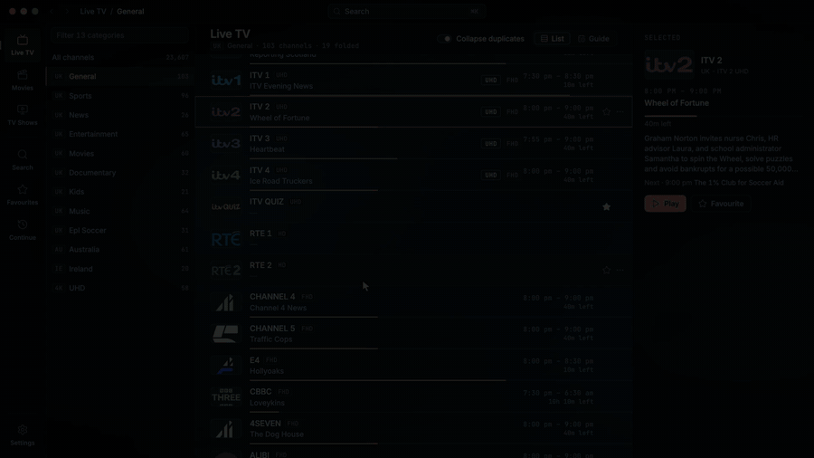

<p align="center">
  <picture>
    <source media="(prefers-color-scheme: dark)" srcset="docs/logo-dark.png">
    
  </picture>
</p>

<p align="center">
  A beautiful, free IPTV player for Windows, macOS and Linux.
</p>

<p align="center">
  <a href="https://github.com/thefutsy/xiptv/releases">Releases</a> ·
  <a href="https://github.com/thefutsy/xiptv/issues">Issues</a> ·
  <a href="LICENSE">MIT</a>
</p>



xiptv comes with no channels and no accounts. You bring an Xtream Codes login or an M3U playlist,
and it plays what your provider sends.

## Features

- **Xtream Codes and M3U.** Remote or from a local file, with an optional XMLTV guide.
- **Live TV, Movies and TV Shows**, each using your provider's own categories.
- **A real guide.** Now and next on every channel row, plus a scrollable timeline. Channels your
  provider ships without listings are matched to the guide by name.
- **Better EPG** Grabs public country guides cover the channels your providers EPG doesn't have. As a result, you get a much better EPG result out the box. Tick them
  on and off in Settings, add any XMLTV URL, or pin a channel to a guide entry by hand.
- **Chromecast.** It finds devices on the network and gives you a docked cast bar.
- Favourites, Continue Watching, search, and a command palette on `Ctrl`/`⌘`+`K`.

## Running it

```bash
npm install
npm run dev
```

To build an installer for the machine you are on:

```bash
npm run dist      # or dist:win / dist:mac / dist:linux
```

You get NSIS on Windows, a DMG on macOS, and AppImage + deb on Linux.

On first launch, add a source. An Xtream account needs the server origin (`http://host` or
`http://host:port`, no path), a username and a password. The guide URL is optional and defaults to
`xmltv.php` on the same server.

## How it works

Most of the design comes from two facts about real IPTV providers: the catalogue is enormous, and
you only get one concurrent connection. As a result, this needs to be handled cleanly.

- **One stream at a time.** Anything that opens a connection closes the previous one and waits for
  it to exit. Providers count refused requests as failed logins.
- **MKV plays through a local remux.** Chromium has no Matroska demuxer, but the streams inside are
  usually H.264 and AAC already, so a local server stream-copies them into fragmented MP4. No
  transcoding, about 0.06s of CPU per 30s of video.
- **Chromecast gets its own URL.** Cast devices cannot demux Matroska either, so live channels and
  MKV films are served to them as HLS from that same local server.
- **Live connections often drop every 30 to 60 seconds** and the provider replays its buffer from the
  start when you reconnect. The app reconnects itself and throws the repeated packets away, rather
  than letting ffmpeg glue them together and drift the audio. This results in a WAY more stable experience compared to other players
- **A few codecs need a real re-encode.** HEVC on Linux, and MPEG-2 or AC-3 anywhere. The player
  retries through an encoding proxy once and remembers, so it costs one hiccup rather than one per
  play. Encoders are picked by test-encoding six frames, because `ffmpeg -encoders` lists what was
  compiled in, not what the machine can actually do.

## Contributing

Issues and pull requests are welcome. `npm run build` runs the typecheck and the production build,
and CI runs the same thing, so keep it green. There is no linter or test suite yet.

Two rules reviews will ask about: close the previous connection before opening another, and never
walk the whole catalogue during a render or on the main thread.

## Licence

MIT. See [LICENSE](LICENSE).
