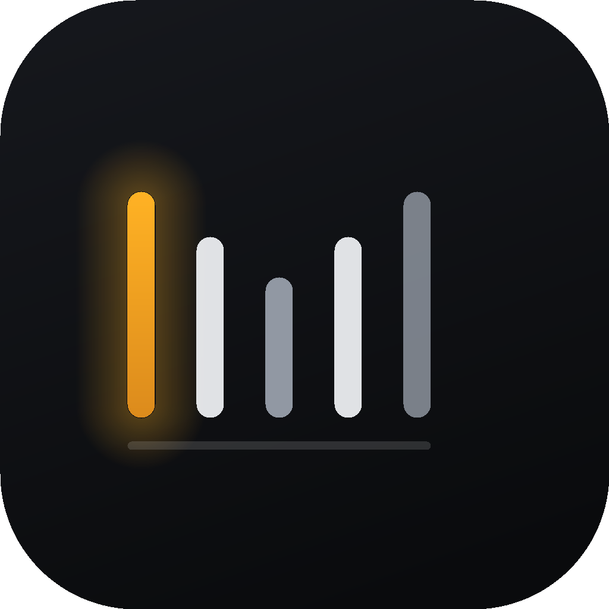

# xiptv

A cross-platform desktop IPTV player. Live TV, Movies and TV Shows, with a real EPG and
Chromecast support. Windows, macOS and Linux.

It ships no channels, no playlists and no accounts. You bring your own Xtream Codes login or M3U
playlist, and it plays what that provider sends.



## What it does

- **Two protocols.** Xtream Codes (host + username + password) and M3U/M3U8 playlists, remote or
  from a local file, with an optional XMLTV guide.
- **Three sections.** Live TV, Movies and TV Shows, each with the provider's own categories.
- **A real EPG.** The full XMLTV guide is streamed, parsed and indexed, with now/next on every
  channel row and a scrollable timeline guide. Channels whose provider gives no `epg_channel_id`
  are matched to the guide by name.
- **Gap-filled guide.** The provider's XMLTV is read first; public per-country guides from
  epgshare01.online then fill in channels it shipped without listings. Feeds are picked from the
  country tags on channel names, can be ticked on and off in Settings, and any XMLTV URL can be
  added alongside them. A channel that matches nothing can be pinned to a guide channel by hand
  from its row menu.
- **Chromecast.** Discovery over mDNS, then transport control from a docked cast bar.
- **Plays what the provider actually sends.** Live MPEG-TS through `mpegts.js`, HLS through
  `hls.js`, plain MP4 natively, and Matroska through a local stream-copy remux (see below).
- Favourites, Continue Watching, a command palette (`Ctrl`/`⌘`+`K`) and a full search page.

## Running it

```bash
npm install
npm run dev          # Vite + Electron with hot reload
```

Build a distributable for the current platform:

```bash
npm run dist         # or dist:win / dist:mac / dist:linux
```

Targets are NSIS on Windows, DMG on macOS, and AppImage + deb on Linux. The bundled ffmpeg is
unpacked out of the asar, because it has to be an executable file on disk.

On first launch, add a source. For an Xtream account you need the server origin
(`http://host` or `http://host:port`, with no path), a username and a password. The guide URL is
optional; it defaults to `xmltv.php` on the same server.

## How it handles a real provider

These are measured numbers from a live account, not estimates. They drove most of the design.

| | |
|---|---|
| Live channels | 23,607 across 451 categories |
| Movies | 132,226 across 202 categories |
| Series | 28,519 across 110 categories |
| EPG | ~413,000 programmes, 126 MB of XML |
| Concurrent streams allowed | **1** |

**Nothing is fully synced.** A full catalogue pull takes over three minutes for series alone, so
categories load on demand and are cached on disk for 12 hours. Every long list and grid is
virtualised.

**MKV is the normal case.** 99.8% of this provider's films are Matroska, and Chromium has no
Matroska demuxer, so `<video src="…mkv">` fails outright. But the streams inside are H.264 + AAC,
which is usually exactly what MP4 carries, so a local HTTP server stream-copies them into fragmented MP4
with ffmpeg. No transcoding: it costs about 0.06 s of CPU per 30 s of video. Seeking restarts
ffmpeg at a new `-ss`, which works because the provider honours HTTP range requests.

**Chromecast gets its own URL.** A cast device cannot demux Matroska either, and will not take raw
MPEG-TS over HTTP, so live channels and MKV films are cast as HLS from the same local server, bound
to the machine's LAN address. Plain MP4 is cast straight from the provider.

**One connection means one stream.** The provider allows a single concurrent connection, so the app
tears down the previous ffmpeg or passthrough, and waits for it to actually exit, before starting
the next one. It is also why the provider's XMLTV is read over one connection while the public
guides are read as parallel ranges: parallel requests carrying the account credentials come back
refused, and the panel counts the refusals as failed logins.

**A live connection lasts 30 to 60 seconds.** The provider then drops it, and a fresh connection
replays its roughly 60 second buffer from the start. ffmpeg's `-reconnect` glues the two responses
together mid-packet and re-bases the backwards jump as new content, so the last minute plays again
after every drop and audio drifts 100-150 ms further from video each time. `live-source.ts`
reconnects instead, and discards the replayed packets by comparing each PID's timestamps against
the last one delivered.

**Public guide feeds download at a random speed.** One connection to the same static file runs at
1-2 MB/s, the next crawls at 13 KB/s for minutes, so a large feed read as a single stream can take
twenty minutes. They are read as 4 MB ranges over six connections instead, and any chunk still
under 100 KB/s after five seconds is abandoned and asked for again on a fresh connection.

**Two thirds of channels have no EPG from the provider.** Only 33% carry a usable
`epg_channel_id`, so the "no guide data" row is designed as the default case rather than an error
state. Fill feeds close much of that gap; pay-TV channels named by dial position (`FOX SPORTS 502`)
are aliased to the brand every public guide uses (`Fox League`).

## Layout

```
src/
  shared/types.ts        the IPC contract, imported by both sides
  main/
    index.ts             app bootstrap, window, and every IPC handler
    lib/xtream.ts        Xtream Codes client and provider-name cleanup
    lib/m3u.ts           M3U/M3U8 parser and fetcher
    lib/epg.ts           streaming XMLTV parser and the merged EPG index
    lib/epgFeeds.ts      catalogue of public fill feeds and country auto-pick
    lib/rangedFetch.ts   guide HTTP, and the hedged parallel ranged reader for big feeds
    lib/live-source.ts   live MPEG-TS reader that reconnects without replaying the buffer
    lib/remux.ts         local stream server: /remux, /transcode, /hls, /direct
    lib/encoders.ts      hardware encoder ladder, each rung validated by a test encode
    lib/cast.ts          Chromecast discovery and control
    lib/store.ts         config, favourites, watch progress, disk cache
    lib/redact.ts        strips provider passwords out of anything a person can see
  preload/index.ts       the contextBridge surface
  renderer/              React app (see styles/tokens.css for the design system)
```

## Notes and limits

- ffmpeg ships via `ffmpeg-static`. On hosts where that static build cannot resolve hostnames
  (a glibc NSS quirk that makes it segfault), the app detects the crash at startup and falls back
  to `ffmpeg` on `PATH`.
- **Some codecs need a real re-encode.** Chromium has no HEVC decoder on Linux and no MPEG-2 or
  AC-3 decoder anywhere, so stream-copying those gives you sound and a black frame. On this
  provider that means the 4K categories and a few regional ones, which are H.265. When the
  browser refuses a track the player retries once through a re-encoding proxy and records that the
  item needs it, so the cost is one hiccup rather than one per play. `encoders.ts` picks the
  encoder by running each candidate on six frames first, because `ffmpeg -encoders` lists what was
  compiled in, not what this machine can actually do: a build with NVENC on a box with no NVIDIA
  driver still lists `h264_nvenc`. NVENC, VideoToolbox, Quick Sync, AMF and VA-API are tried in
  that order, with libx264 as the last rung. This is the one path here that costs real CPU.
- **Chromecast was verified against a stubbed receiver**, not a physical device. Discovery,
  connect, load, transport and teardown are exercised; the handshake with real hardware is not.
- Provider credentials are stored in plain text in `config.json` under Electron's `userData`
  directory, mode `0600` on POSIX. This is the same trade-off every desktop IPTV client makes.
- Packaging was run on Linux only. The Windows and macOS targets are configured but unbuilt.
- **ffmpeg licensing.** This source is MIT, but `npm run dist` bundles an ffmpeg binary.
  `ffmpeg-static` ships an LGPL build; `scripts/fetch-ffmpeg.mjs` pulls the GPL builds from
  BtbN/FFmpeg-Builds for hardware encoding. If you redistribute a packaged app built with the
  latter, the GPL terms apply to that artifact.

## Contributing

Issues and pull requests are welcome. `npm run build` runs the typecheck and the production build,
and CI runs the same thing, so keep it green. There is no linter and no test suite yet.

Two rules the code holds to, and reviews will ask about:

- **One connection.** The provider allows a single concurrent stream and counts a refused request
  against the account, so anything that opens a connection closes the previous one and waits for it
  to exit first. A 401 or 403 is never retried.
- **Nothing is fully synced.** The catalogue is far too big to walk. Categories load on demand and
  every long list is virtualised. No code path may walk the whole catalogue during a render or on
  the main thread.

Credentials live in stream URLs, ffmpeg command lines and XMLTV URLs. Anything that can reach a
log, an error message or the UI goes through `redact.ts` first.

## Licence

MIT. See [LICENSE](LICENSE).
